# 概述

## 什么是 internet

从具体构成看：节点——主机及其上所运行的程序(**源/目标节点**)和路由器交换机(**中转节点/数据交换节点**)；边——通信链路，如光纤、同轴电缆、无线电 、卫星；协议——定义了不同终端中**对等层的实体**(ip对ip 网卡对网卡)通信的**规范**，包括了**报文格式**和**次序**，以及处理请求的**动作**等。

简言之互联网是网络的网络，是很多个通过路由器连接起来的网络

从服务的角度看：

+ 互联网是使用通信设施进行通信的**分布式应用**
+ 为app提供通信服务(编程接口)的**基础设施**，服务分为：无连接不可靠服务(UDP) 面向连接可靠服务(TCP)

从构成角度看，互联网分为**网络边缘，网络接入和网络核心(**数据交换)、

带宽：**单位时间内能传输的数据量**

## 网络边缘

网络边缘包括**主机(端系统)**和运行在**网络边缘上的应用**

应用有两种架构模式：

**客户端服务器模式(c/s)**：客户发送请求，服务器响应请求。这种模式可扩展性比较差，一般随着请求载荷的增加，能力会不断下降，但是该模式达到阈值时会断崖式下降。

**对等模式(peer-peer p2p)**：**没有专门的服务器**，客户端可以向其他的客户端发送请求(向A请求一段，向B请求一段)，也可以给其他的客户端提供服务。	

握手：**在数据传输之前做好准备**，表现为两个通信主机之间为**连接建立状态**。

在端系统之间传输数据，网络边缘使用**采用网络设施的面向连接服务TCP(有握手)**和**采用基础设施的无连接服务UDP**

## 网络核心

网络核心用于数据交换，是**路由器的网状网络**。

数据交换有两种方式：

电路交换：在源主机和目标主机之间分配了线路，**独享资源保证性能**，如果呼叫没有数据发送则被分配的资源就会被**浪费**，**连接建立时间长**，通常被传统的电话网络采用。网络资源(带宽)被分为**片**，方式有**频分，时分**

​	

计算机之间的通信具有**突发性**，如果使用线路交换则**浪费的片比较多**，即使这个呼叫没有数据传输，其所占据的片也**不能被别的呼叫使用。**

分组交换：传输时使用**全部**带宽， 主机之间传输的数据被分为一 个个**分组**，到达下一个节点先**全部存下来(防止共享)**然后再传输到下一个节点，**资源共享，按需使用**，**延迟高于电路交换**，存在**排队延迟**。

分组交换按**有无网络层的连接**分为**数据报网络和虚电报网络**，数据报网络：通信之前无需**建立起连接**，有数据就传输；每个分组都有目标主机的**完整地址，独立传从**；虚电路： 两个主机通信前建立起**连接**，每个分组按照**虚电路号**标识。

发送和接收算是一次延时，发送需要时间，接收也需要时间，但是它们是**同时进行**的，因此算**一次**时间。

如果到达速率**大于**链路的输出速率，分组将会**排队等待输出**，如果路由器的缓存**用完了**分组将会被**抛弃**

网络核心的关键功能：**路由**——**决定分组采用的源到目标的路径(通过路由算法)**；**转发**——**将分组从路由器的输出链路转移到输入链路(通过路由算法给出的路由表)**

## 接入网

接入网主要分：住宅接入，单位接入，无线接入

### 住宅接入

modem： 将上网数据**调制**加载音频信号上，**在电话线上传输**，在局端将其中的数据**解调**出来；反之亦然。速率**低于56**kbps，不能**同时**上网和打电话。

digital subscriber line (DSL)：还是用电话线上网，可以**同时**电话和上网。

线缆网络：对有线电视信号线缆**双向改造**，**在不同频段传输不同信道的数据**。 **非对称**: 最高30Mbps的下行传输速率, 2 Mbps 上行传输速率。**线缆和光纤网络**将个家庭用户接入到 **ISP 路由器**， 各用户**共享**到线缆头端的接入网络

### 企业接入

### 无线接入

各无线端系统共享无线接入网络

​	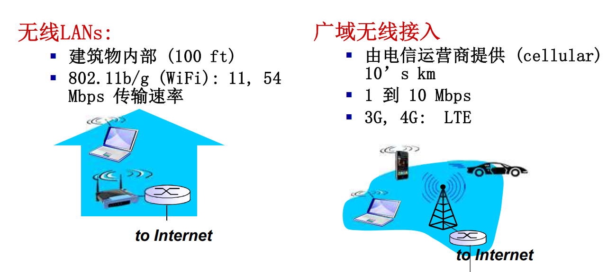

## 物理媒体

物理链路：**连接每个发送-接收对之间的物理媒体**(网线 光纤)，分为**导引型媒体**(有形)——信号沿着固体媒介被导引，非导引型媒体——信号自由传播

物理媒体包括：双绞线 (TP)——两根绝缘铜导线拧合，同轴电缆——两根同轴的铜导线，光纤和光缆——光脉冲，每个脉冲表示一个 bit，在玻璃纤维中传输，低误码率高速安全。

一种无形的物理媒体，无线链路是**开放空间传输电磁波，携带要传输的数据**，无需物理“线缆” 双向，容易受到环境影响——反射吸收干扰，类型有地面微波 ，LAN (e.g., WiFi)，wide-area (e.g., 蜂窝)，卫星。

## Internet结构和ISP

互联网的结构是**网络的网络**

 

端系统通过**接入到ISP**连接到互联网，ISP需要是**互联**的。

ISP提供者之间也会有合作和竞争

此外，ICP(内 容 提 供 商 网 络：百度，谷歌等)为了**减少接入ISP的成本并提供更好的服务**，会在全球范围内构建**自己的专网**(通过数据中心用线缆连接在一起，这些数据中心一般建立在**核心ISP附近**)

第一层ISP(中心)，国家/国际覆盖，速率极高，**直接与其他第一层ISP相连**，与大量的第二层ISP和其他客户网相连

第二层ISP：更小些的 (通常是**区域性的**) ISP，与**一个或多个第一层**ISPs连接，也可能与其他第二层ISP连接

第三层ISP与其他本地ISP： 接入网 (与端系统最近)

IXP 互联网交换点 **允许ISP在自己的网络之外共享传输**

## 分组延时

分组延时由四部分组成：

+ 节点处理延时：**检查bit级错误 检查分组首部和决定将分组导向何处**
+ 排队延时：**在输出链路上等待传输的时间**    **流量强度**=(分组长度*分组到达对立的平均速度)/链路带宽 接近**0**时平均排队延时会**很小** 接近**1**时会**很大** **超过1**则**趋于无穷大**
+ 传输延时： **把数据送到链路上的时间 分组长度/分组带宽**
+ 传播延时：**物理链路的长度/媒体中的传播速度**

用车队类比 汽车是一个bit而车队是一个**分组**

汽车以**100 km/hr** 的速度传播 收费站服务每辆车需**12s(传输时间)** 车队在第二个收费站排列好之前需要62min——最后一辆车准备传播时已经过去了2min 然后再在路上跑60min，**注意所有的汽车被第一个收费站服务之前，一些汽车会到达第二个收费站**

**节点延时=四部分的和**

Traceroute诊断程序：提供**从源端经过路由器到目标的延时测量** 沿着目的地路径向**每个路由**发送3个探测分组，路由器会**返回**一个分组 计算发送和回复之间的**时间间隔**

链路的队列缓冲区容量有限，当分组到达一个满的队列时，**该分组会丢失**，丢失的分组可能会被**前一个节点或源重传 或者不传**

吞吐量：**在源和目标端之间传输的速率** 端到端的吞吐量一般取路径上传播的**最小速率**

端到端的吞吐为min(Rs,Rc,R/10)

## 协议层次

网络是一个复杂的系统 采用**层次化方式**实现复杂的网络功能

将网络的复杂功能分为**功能明确的层次**，每一层都实现了**一个或一组功能**

**服务(Service)**：**低层实体向上层实体**提供它们之间的通信的能力

**协议(protocol)** ：**对等层实体**(peer entity)之间在相互通信的过程中，需要**遵循的规则**的集合

分层思想被认为有害的地方：**每一层可能冗余较低层的功能** **某一层的功能可能需要其他层的信息**

internet协议栈

+ 应用层：**网络应用程序和它们的应用层协议存留的地方**
+ 传输层：**为进程之间的通信提供服务**
+ 网络层：**主机之间的数据传输，将数据报传输到目标所在的子网 ** 
+ 链路层：**相邻网络节点之间的数据传输**
+ 物理层：在线路上传输bit

IOS/OSI参考模型（国际组织提出的） 多出了两层但是这两层——表示层：**允许应用解释传输数据** 会话层：**数据交换的同步检查恢复**，这两层可以被放到应用层中 一般用的都是internet协议栈

数据从**发送端的协议栈向下，沿着中间的链路层交换机和路由器协议栈上上下下，然后向上到达接收端系统的协议栈**

注意这里的链路层交换器只实现了第一和第二层，**没有网络层不能识别IP** 除非是三层的	链路层交换机

各层次的协议数据单元

## 网络攻击

+ 植入有害程序 
+ 拒绝服务攻击 类似于大量的请求
+ 嗅探分组 窃取敏感信息
+ IP哄骗 伪装称你认识的人

# 应用层

**网络核心(链路层交换机，路由)上没有应用层软件，网络应用只在端系统上存在，网络核心设备并不在应用层上起作用，它只对较低层有用**

主机由**IP**标识(一个IP可以标识**多个**主机)，主机中的进程由**端口**标识

## 体系架构

应用程序体系解构规定了如何在**各种端系统上组织应用程序**

+ 客户-服务器模式C/S

服务器：**一直运行**，**固定的地址(IP)和端口号**，**扩展性差**

客户端：**动态IP，不直接与其他客户端通信，主动与客户端通信，与互联网间歇性连接**

对于大型的网站一个服务器是跟不上所有的请求的，为此需要配备具有**大量主机的数据**中心

+ 对等模式P2P

**几乎没有一直运行的服务器，端系统之间可以直接通信(无需通过服务器)，每一个节点即使C又是S，端系统可以改变IP地址难以管理，具有自扩展性的特点**

## 进程

进程是在**主机上运行的程序**，j进程在同一主机内使用**进程间通信机制(操作系统定义)**来通信，在不同主机间通过**交换报文**实现通信。

进程可以分为客户端进程——**发起通信**，和服务端进程——**等待连接**

从一个进程向另一个进程发送报文必须通过**下面的网络层**，进程通过**嵌套字**socket发送报文和接收报文，一个进程会有**多个嵌套字**——嵌套字可以对应进程中的**一个线程(轻量级进程)**。

嵌套字相当于一个**门**，是一台主机**应用层与网络层的接口**，应用层可以控制嵌套字在应用层端的**一切**但网络层是**无法控制**嵌套字的。

应用层对网络层的控制仅限于：**选择运输层协议，设置几个运输层参数**

## 传输层提供的服务

传输层的服务大体分为四类：**可靠数据传输，吞吐量，定时，安全性**

TCP可靠的传输服务——**流量控制**:发送方不会淹没接收方，**面向连接**，**拥塞控制**:当网络出现拥塞时能够抑制发送方

UDP无连接的传输服务会丢失数据**但比较快**

注意UDP和TCP都没有**加密**，所以网络层是**不提供加密**的，加密是通过**SSL**(安全套接字层)在**应用层**上实现的，是对TCP的**强化**

两种协议都不提供**吞吐量和定时**的服务，注意服务中的安全性指的是**数据完整不丢失**

## 应用层协议

应用层协议定义了**运行在不同端系统上的应用进程如何交换报文**，它规定了**报文的类型**(响应/请求)，报文的**语法**，字段的**语义**，进程**如何何时**发送。

有的应用层协议是由RFC文档定义的，因此它们位于**公共域**，，比如HTTP，如果浏览器开发者遵从HTTP RFC规则，那么该浏览器就能访问任何遵从该文档标准的web服务器，此外还有一些私有的协议。

**应用层协议只是网络层的一部分**

​																

## web和HTTP

web的应用层协议是**HTTP(用TCP作为运输协议)**，客户从嵌套字接口发送HTTP请求报文，并接受响应报文，服务器从嵌套字接口接收请求报文并返回响应报文。注意服务器不保存**关于客户的任何信息**，HTTP是**无状态协议**。

HTTP分为**非持续连接** ——每个请求响应经过**一个单独**的TCP连接 每个TCP在服务器**传输完数据后会关闭**，**持续连接**——所有的请求响应经过**同一个**TCP连接。

定义**RTT**为分从从客户出发再返回回来的时间，从服务器请求一个数据所需的时间为**2RTT(先进行一次握手，再搬运数据)+数据传输时间**，一个RTT用于建立连接，一个用于请求和接收对象

假设有十个对象那么非持续连接=10RTT+10RTT+10数据传输时间，持续性连接=1RTT+10RTT+10数据运输时间

HTTP请求格式

第一行是请求行(方法，URL，HTTP版本)，其后继是请求头，每行**以回车和换行结尾**，最后一行再附加一个回车和换行用于和请求体隔离开

HTTP响应格式同理

web页是由**对象(文件)**组成的，比如html文件 ，媒体文件，图片之类的，这些对象都可以通过**URL(**uniform resource location，由**存放对象的主机名和对象的路径名**组成)寻址，多数web页面包括一个**基本的HTML文件**，这个基本的HTML文件**通过URL引用页面中的其他对象**，

##  cookie

为了把内容和用户身份联系起来，HTTP使用了cookie，**它允许站点对用户进行跟踪**

cookie有四个组件

+ HTTP响应报文中有一个cookie首部行
+ HTTP请求报文中有一个cookie首部行
+ 用户端系统有一个cookie文件，由浏览器管理
+ 服务器有一个数据库

如果没有访问过一个网站，那么在服务器在接收到请求时会生成一个**唯一的识别码并在后端服务器产生一个表项**，然后在响应报文中**包含一个setcookie**，客户在接受了响应报文发现setcookie后，**浏览器会在cookie文件中添加一行记录识别码**，在之后的访问中浏览器会**查询cookie文件**并抽取对应的识别码，然后**放在请求报文**中。

## 电子邮件

由三个部分组成：**用户代理，邮件服务器，传输协议SMTP**

用户代理会向邮件服务器**发送邮件**，从邮件服务器中**取出邮件**

邮件发送的过程如下：

+ A的**用户代理**用**SMTP**把报文发送给**邮件服务器**，报文会被放在**报文队列**中
+ 运行在A邮件服务器上的**SMTP客户端**发现了报文，创建一个到B的SMTP服务器的**TCP连接**
+ 握手之后，**SMTP通过TCP连接发送报文**
+ B的邮件服务器上，**SMTP的服务器端接收到报文**，B的邮件服务器将报文放入邮箱
+ B调用**用户代理**查看报文

如果发送方**无法**将邮件发送到接收方的服务器，则报文会被保存在发送方的**报文队列**中，并在之后尝试发送。

**A的用户代理与B的邮件服务器**之间是不存在一个**直接的SMTP连接**的，所以A的邮件代理**必须通过**A的邮件服务器

SMTP是电子邮件中主要的**应用层协议**，**使用持续连接**，它使用**TCP**作为传输服务，和HTTP一样有两个组成部分：运行在发送方邮件服务器的**客户端**和运行在接收方邮件服务器的**服务器端**。SMTP一般不使用**中间邮件服务器**发送邮件。

SMTP与HTTP的不同：后者是**拉协议**——用户使用HTTP从服务器拉取信息，后者是**推协议**——发送邮件服务器把文件推向接收邮件服务器；SMTP要求每个报文采用**7比特ASCIIA码**格式，在传输前要把多媒体数据编码为ASCII码，接收后再解码；前者将**每个对象**封装到**各自的响应**中，后者将**所有的报文对象放在一个报文**中。注意取报文是一个**拉**的动作而SMTP是**推**报文，所以B的用户代理是**无法使用SMTP**从B的邮件服务器得到报文的，目前主流的访问协议是**POP3**

邮件访问采用了**C/S**结构，接收方可以在PC上运行**用户代理程序**，但是不能直接使用**邮件服务器**，如果邮件服务器运行在PC上那么为了**任何时候**都能接收到邮件，PC必须**一直保持在线**，这是不现实的。

## DNS

一个由**分层DNS服务器**实现的**分布数据库**，一个使得主机能够查询数据库的**应用层协议**，**用于将主机名转换为IP地址**

当发送请求的时候，浏览器从URL中提取出主机名，并将主机名传递给**本机上运行的DNS的客户端**，DNS客户向DNS服务器**发送一个包含主机名的请求**，**DNS客户会受到一份回答报文**其中包含了该主机名的IP地址，一旦浏览器得到了DNS的IP地址它就会发起一个TCP连接。

DNS的一个简单设计是：在因特网上只使用一个DNS服务器，该服务器包含所有的映射，这种设计的问题在于**单点故障，通信容量不足，维护成本大，远距离导致的时延，难扩展**

另一种设计是分布式数据库，DNS使用了大量的DNS服务器，它们以层次方式组织并分布在全球范围内，大致上有三种类型的DNS服务器:**根DNS，顶级域(TLD)DNS，权威DNS**

例如`www.xxx.com`，`www`为三级域名、`xxx`为二级域名、`com`为顶级域名，系统为用户做了兼容，域名末尾的根域名`.`一般不需要输入

此外还有一种本地服务器(**严格上不属于层次结构**)，每个ISP都有一个本地服务器，当本地发起一个DNS查询时，查询会被送到本地DNS服务器，起到代理的作用将查询**转发到层次结构**中。

查询域名的方式有两种：

**递归查询，这种方式下根服务器的负担太重**，如果 A 请求 B，那么 B 作为请求的接收者一定要给 A 想要的答案

迭代查询，**当前联络的服务器给出可以联络的服务器**，我不知道但我清楚谁知道

DNS通过**缓存**机制提高效率

查询过程如下：

负载均衡：一个规范主机名和一个IP地址集合(多台服务器)联系

## 文件分发时间

从**一台**服务器分发文件(大小为F)到**N个对等体**需要的时间,U表示上传速度，d表示下载速度

在C/S架构下，**D=max(NF/Us,F/min(d))**就是服务器**传输完N个文件**和**最慢的对等体下载完文件**的时间的最大值，所需时间线性增长

在P2P架构下，**D=max(F/Us,F/min(d),NF/(Us+sum(u)))**，**服务器至少需要上传一个文件**，**所有客户端同时帮助上传所有文件**

## CDN

HTTP对多媒体文件提供的服务有**严重缺陷**，即所有客户接收到**相同编码**的视频，尽管对不同用户或者相同用户不同时间而言，可用的带宽大小有很大的不同。

为此研发了一种经HTTP的动态适应流**DASH**，在DASH中视频编码被分为几个**不同的版本**，其中每个版本有不同的**比特率**，对应不同的**质量水平**，客户**动态地**请求来自**不同版本**且长度为几秒的**视频段数据块**。

服务器：**视频被分为多个块，每个块独立存储，编码与不同的码率，还有一个告示文件提供块的URL**。

客户端：**首先请求该告示文件**，然后**周期性的测量带宽**，查询告示文件，在**一个时刻请求一个块**，**HTTP头部指定字节范围**，**在会话的不同时刻可以切换请求不同的编码块。**

客户端可以自适应决定**什么时候**去请求块，请求**什么码率**的块，**去哪里**请求

服务器如何通过网络向上百万用户同时流化视频内容？

+ 单个的超大的超级服务器中心，不可扩展，单点故障，较远的用户跳数多，内容经过相同的链路发送多次
+ 通过CDN，**全球部署网络节点**，**存储服务内容**，**就近**为客户提供服务，CDN中**储存内容的多个拷贝**，用户从CDN中请求内容
  + 深入：将CDN服务器深入到许多接入网(在遍及全球的ISP中部署服务器集群)，更接近用户，数量多，管理困难
  + 邀请做客： 部署在少数(10个左右)关键位置(在关键位置如IXP建造大集群) 维护成本低，用户时延较高

当用户请求某个视频时，CDN必须截获该请求以便：**确定适合于该用户的CDN集群，将客户的请求重定向到集群中的某个服务器**。大多数CDN通过**DNS**来截获和重定向请求

任何CDN部署，核心是**集群选择策略**即**动态的将客户定向到CDN中的某个服务器或数据中心**，一种简单的策略是**地理上最近(本地DNS)**，但地理上最近就**跳数**和**网路路径的长度**而言并不一定是最近的，且本地DNS也可能离用户较远。

请求过程如下：

在向网站发送请求后，网站发现请求的是一个视频，然后返回**第三方的CDN的主机名**

由于没有返回IP所以会再次请求，这次请求的是第三方CDN的**服务器**

CDN服务器接收到请求后会返回其集群中**某个内容服务器的IP地址**，这个服务器是经过负载均衡智能调度后给出的，最后本地通过这个IP地址访问到对应的服务器然后请求视频数据。

这里的1是访问网站的HTTP请求

## 网络字节序

大端和小端，表示多字节值的那一端储存在**起始地址处**，大端：**最高有效位储存在起始地址**，小端：**最低有效位储存在起始地址**。

网络上传输的数据都是**字节流**，在进行传输时会**先传输哪个字节**？**接收到的字节是作为高位还是低位**？

UDP/TCP/IP协议规定：**把接收到的第一个字节当作高位字节看待**，因此发送端需要**先发送高位字节**，而发送是从**起始地址**开始的，因此**网络字节序是大端字节序**

每台计算机的**主机字节序各不相同**(由CPU架构决定)，因此在网络通信中需要将**主机字节序转化为网络字节序**，接收方**再转换回主机字节序。**

## TCP套接字编程

构建能借助sockets进行通信的C/S应用程序

过程如下：
	

1.服务器首先运行，等待连接建立

+ 创建socket
+ 和一个端口绑定
+ **阻塞程序**等待接收客户端的连接

2.客户端主动与服务器建立连接

+ 创建socket，**自动绑定**一个端口
+ 指定**服务器的IP与端口**，建立连接

3.当客户端的连接请求到来时

+ 服务器接受客户端的连接请求，解除阻塞式等待，**返回一个新的socket与客户端通信**

注意服务器可以与**多个客户端通信**，初始创建的socket是**不能读写**的只有**连接建立成功**后才能读写(客户端是**connect成功**，服务器是**accpet返回新的套接字**)

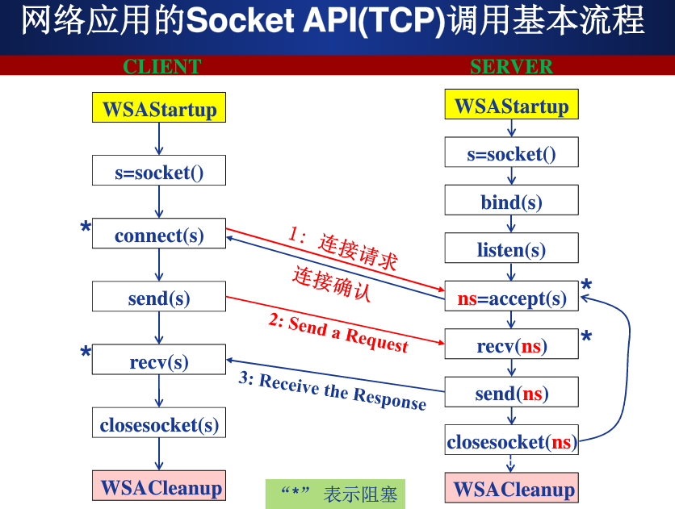

# 运输层

为运行在不同主机上的应用进程之间提供**逻辑通信**

运输层协议是在**端系统**中的而不是在**路由器**中实现的，在发送端，运输层将从发送应用进程接收到的报文转换为**运输层分组(报文段)**，实现的方法可能是将应用报文划分为较小的块，并为每块加上一个运输层报文段，然后在发送端系运输层将这些报文段传输给网络层。

**运输层协议**能提供的服务常常**受限于底层网络层协议的服务模型(但不完全受限)**

例如网络层协议无法为主机之间发送的运输层报文段提供**时延或带宽**保证的话，运输层协议也就无法为进程之间发送的应用程序报文提供**时延或带宽保证**。

然而，即使**底层网络协议不能在网络层提供相应的服务，运输层协议也能提供某些服务。**例如，底层的网络协议是不可靠的，但是运输协议能为应用程序提供可靠的数据服务。

## 简述网络层

网络层协议有一个名字**IP**，为**主机之间提供逻辑通信**，IP的服务模型是**尽力而为的交付服务**，它不保证报文段的交付，报文段的按序交付，数据的完整性。IP被称为**不可靠服务**

## 多路复用和多路分解(解复用)

多路分解：**将运输层报文段中的数据交付给正确的嵌套字的工作**
	多路复用：在源主机从不同的嵌套字中收集数据块，并为每个数据块封装上首部信息从而生成报文段，然后将报文段传递给网络层

当运输层接收到数据时，它需要将数据定向到对应的进程上。接收主机的运输层实际上并没有将数据**直接交付给进程**而是将数据交付给了一个**中间的嵌套字**，在任意时刻接收主机上可能不只有一个嵌套字，所以每个嵌套字有**唯一**的标识符，标识符的格式取决于所用的**运输层协议**。

UDP的嵌套字由一个**二元组**标识的，包括一个**目的端口**和一个**目的IP**，如果两个报文段的**源IP和源端口不同**但是**目的IP和目的端口**相同，那么这两个报文端将通过**相同的目的嵌套字**被定向到相同的进程。**源端口号用作“返回地址的一部分”**，当接收方需要回发一个报文段给发送方时，会从**源端口号中取值作为目的端口号**。

TCP的嵌套字由一个**四元组**标识的，**源IP 源端口 目的IP 目的端口**，只要有**一个不同**就会对应到**不同的嵌套字**。

IP信息是网络层添加给头部的，从网络层到运输层时，**包含网络层添加的头部会被去掉**，但是**IP信息是会被提取并储存**，以供运输层使用。

持续性的HTTP会在**一个嵌套字内**交换HTTP报文，非持续性的HTTP对每一对请求/响应**创建一个新的嵌套字并在之后关闭**

客户端会让**运输层自动分配**端口号，而服务器则是分配一个**特定**的端口号

## UDP

**数据交付和差错检查**是**最低限度**的运输层服务，也是UDP**仅有**的服务。

尽力而为的服务：报文段可能**丢失，乱序**，无连接：不会进行**握手**，每个UDP报文段**独立**地处理，**DNS 流媒体**使用UDP传输。

如果想在UDP上进行**可靠的**传输，可以在**应用层做相应的处理**或**应用特定的错误恢复**

UDP存在的理由：**不建立连接，简单报文段头部很小，无拥塞控制和流量控制**

UDP检验和：发送方将**伪首部，头部和数据(检验和字段排除)**部分按**16位**分组，不足16位则**末尾补0**，将这些分组**相加**，如果有**溢出**要进行**回卷（把1加到末尾）**，最后将结果**按位取反**放到报文段头部的检验和字段。接收端收到数据后做**同样的运算**，如果计算出的结果与检验和字段**相加全为1**，则检验通过(也可以取反和检验和一一比较)

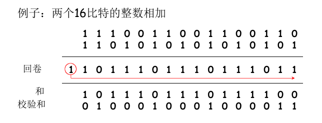

## 可靠数据传输(rdt)

这里的一个假设是**分组将以它们发送的次序进行交付(底层信道不会对分组重新排序)，某些分组可能会丢失**。

这里将模型用**有限状态机(fsm)**标来描述发送方和接收方

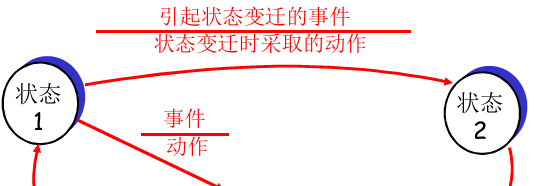

### 具备完全可靠信道——rdt1.0

这是最简单的情况，即底层信道是**完全可靠**的，没有**比特错误**和**分组丢失**

​	

发送方只通过**rdt_send():被上层（如应用层） 调用，以将数据交付给下方的发送实体**，经过**make_pkt(data)产生分组**，然后**udt_send():被rdt调用，用以将分组放到不可靠的信道上传输到接收方**。

接收方只通过**rdt_rev(packet)**事件**从底层信道接收一个分组**，从分组中经由**extract(packet,data)动作取出数据**，并通过**deliver_data(data)**将数据上传给较高层。

有了完全可靠的信道，接收端就不需要**发送任何反馈信息**给发送端

### 具有比特差错信道——rdt2.0

底层信道中的分组**可能受损**

当报文的接收者在收到了**受损的分组**后会要求发送者**重传报文**，基于这种重传机制的可靠数据传输协议称为**自动重传协议**(ARQ)

在ARQ中还需要**差错检测，接收方反馈(返回一个比特的分组信息标识)，重传**三种协议功能来处理比特差错

rdt2.0被称为**停止等待协议**：发送方发送一个分组，然后等待接收方回答

这里发送方的分组中会带有**检验和**，发送方在发送数据后会等待接收方的回复，如果收到**NAK(错误)**就**重传分组继续等待**，如果收到**ACK(正确)**则**不会执行动作**

接收方收到分组后，如果检测到**错误**则发送一个**NAK**给发送方然后**继续等待分组**，正确则将数据发送给信道然后继续等待。

然而rdt2.0没有考虑到**NAK和ACK可能会受损的情况**，如果这两个数据受损，则发送发不知道接收方是否正确接受了分组。一个看你的解决方案是，如果发送方收到了受损的NAK或ACK，那就**重新传输当前的分组**，但是这种方法在发送方和接收方的信道中引入了**冗余分组**，即接收方**不知道发送方是否收到了ACK.NAK**，这使得接收方无法判断**当前收到的分组是上次的还是新的**

rdt2.1在此基础上一个简单的方法是**在数据分组中增加一个新字段**，让发送方对数据分组**编号**，接收方只需**检查序号**即可确定收到的分组是否是一次重传。序号只需要**0和1**就足够了。

这里的状态数比之前**多了一倍**，因为协议需要反映出**当前发送的分组/(接收方)希望接收到的分组**的编号是**0还是1**，如果接收方没有收到预期编号的分组，说明发送方没有收到NAK，那么发送方会重新发送一次NAK然后继续等待

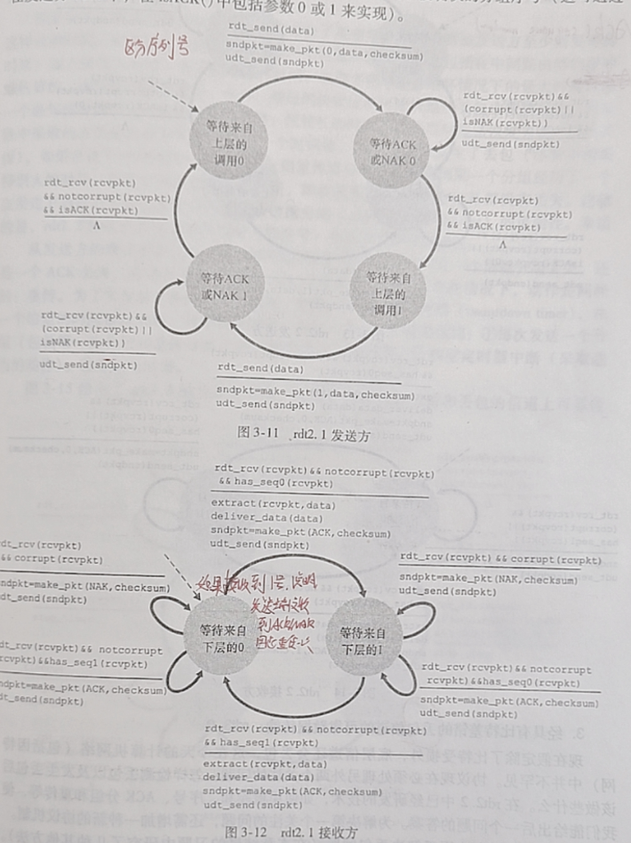

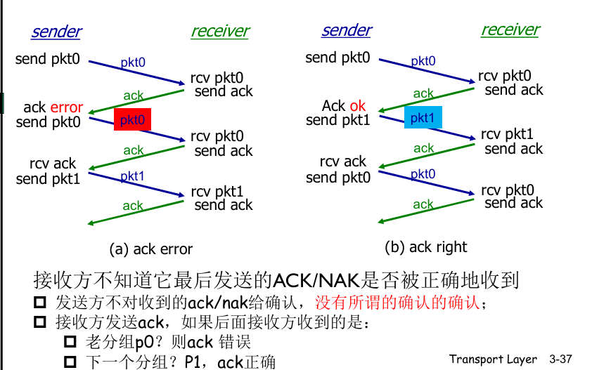

rdt2.2 **给ACK编号**，发送方收到**重复的ACK**则执行和NAK一样的操作，省去了NAK，接收方的**1端**如果发现了分组有损失就会回发**ACK0**，即取反的序号表示NAK

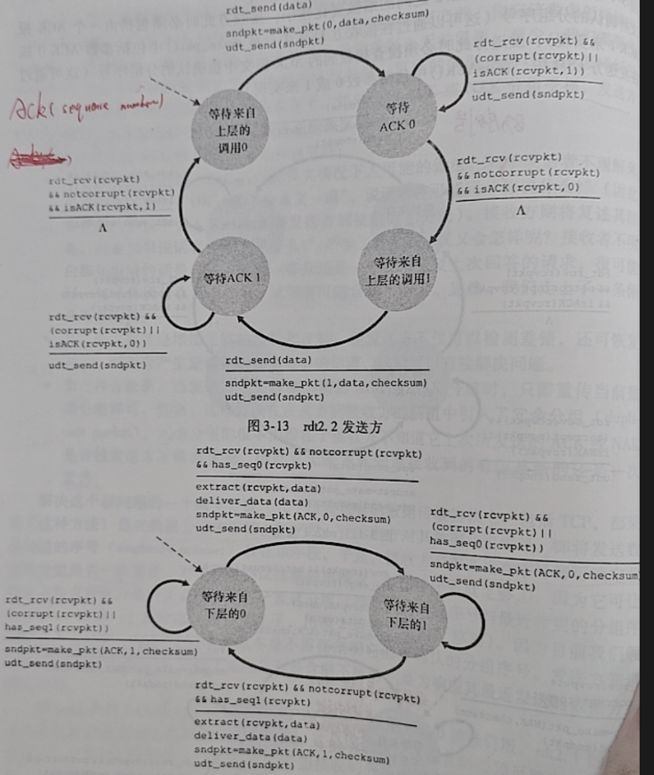

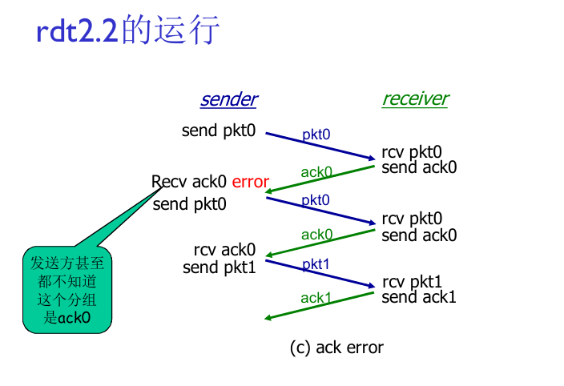

### 具有比特级差错的丢包信道——rdt3.0

该协议下，**发送方**负责**检测**和**恢复**丢包工作，通过**倒计数定时器**，至少等待发送和和接收方之间的**一个往返时延**加上接收方**处理一个分组所需的时间**，如果发送方在规定的时间内**没有收到ACK**，则**重传分组**，即使ACK并不是丢失而是**延迟**了。

长时间没有收到ACK则重发分组

由于返回的ACK丢失了，发送方会进行重传，而接受方收到**冗余的分组**，接收方会**直接丢失冗余**的分组  ，但还是会**发送一个对应ACK**     

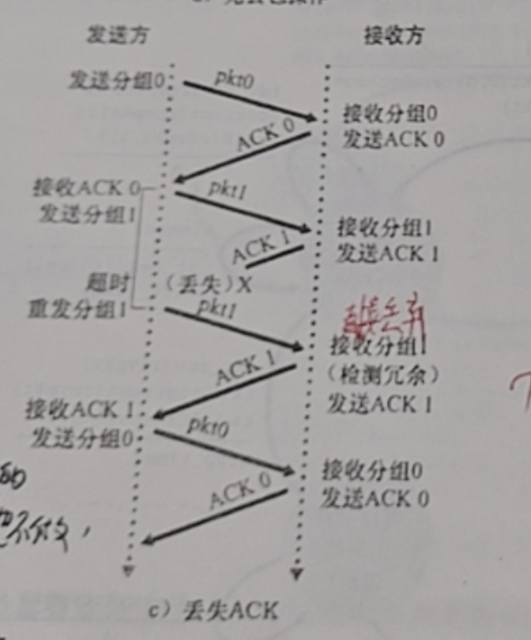

由于返回的**ACK延迟**，发送方重新发送分组，这会导致**多个ACK**返回，当接收到第一个ACK后发送方开始发送**下一个分组**，当收到了之前的ACK时，发送方会忽略该ACK**(什么都不做**)

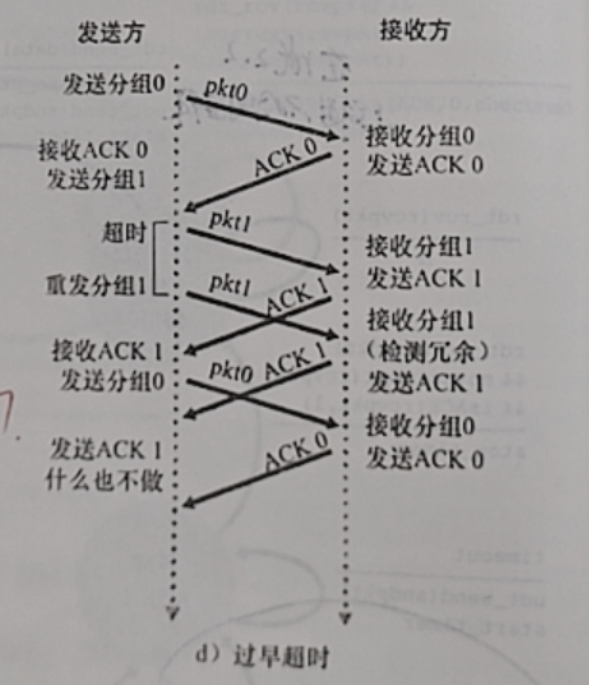

rdt3.0的性能很差

在R=1Gbps(注意这里是速度单位，Gbps=$10^9$b/s)的链路，15ms端-端传播延时(RTT=30ms)，分组大小L=1kB(8000b)时，发送时间(发送后到接收到ACK所需时间)等于=**RTT+L/R**，而发送方实际将比特送到信道中的时间是**L/R**，实际的**利用率U**很低，这里假设ACK很小

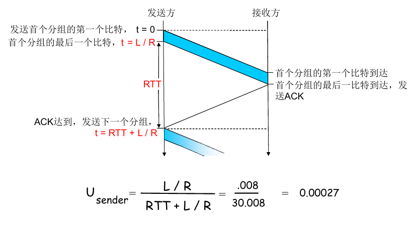

瓶颈在于**网络协议限制了物理资源的利用**

## 流水线可靠数据传输协议

**不以停等方式运行，允许发送方发送多个分组而无需等待确认**。

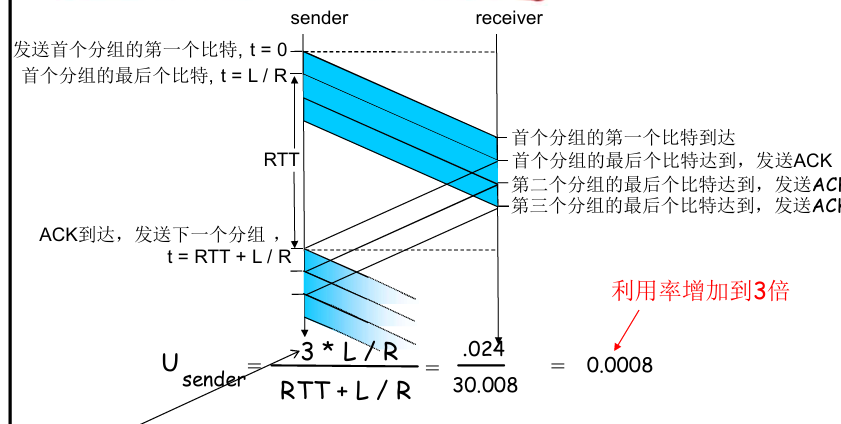

瓶颈转移为**链路带宽**

流水线要求：

+ 必须增加**序号的范围**
+ 在发送发和接收方要有**缓冲区**，用于缓存分组

两种通用的流水线协议是**回退N步和选择重传**

### 回退N步(GBN)

GBN将可用信号范围划分为四段，基序号base指向**第一个已发送但未确认的分组**

发送方：

+ 当上层调用rdt_sent()时，发送方会先检查发送窗口是否已满(有N个已发送但未确认的分组)，如果未满则产生一个分组并发送并相应地更新变量，反之发送方会将数据返回给上层，隐式地指示上层窗口已满
+ 收到一个ACK采用**累计确认**的方式，表示接受方已正确接收**n以及n之前的分组**
+ 发送了超时或者丢失，则发送方**重传所有已发送但未被确认过的分组**，会对第一个已发送但未确认的分组设置**计时器**。
+ 收到老分组的**重复确认**，无动作，
+ 收到**乱序**的确认号，忽略

接收方：

+ 接收方窗口大小等于1

+ 如果一个序号为n的分组正确收到，并且**按序**(即上次交付给上层的数据是序号为n-1的)，那么接收方为分组n**发送一个ACK并将该分组传递该上层** 。
+ 收到**乱序**分组，接收方会**丢失**该分组，**并为最近按序接收到分组发送ACK**。即发送**累计确认**

### 选择重传(SR)

发送方

+ 从上方接收到数据后，检查下一个可用的分组序号，如果该序号位于发送方的窗口内则发送数据，反之要么将数据缓存要么返回给上层
+ 每个分组必须有自己的**定时器**，超时了只会重发**当前这个分组**
+ 当收到一个ACK时，如果分组序号**在窗口内**则将被确认的分组标记为**已接收**，如果该分组序号是**send_base**，**则窗口会前移直到send_base未确认(即从头开始连续的)**，**并发送新的分组**

接收方

+ 接收方窗口大于1

+ 可以**乱序**接收，收到的分组落在窗口内则**返回一个ACK**，对每个分组单独确认。一旦**从头开始的窗口连续了**就将这段连续的分组**返回给上层**，然后**移动窗口**，因此会**按序**上交分组
+ 如果收到的分组在窗口之前，也会返回一个ACK
+ 其他情况，忽略分组

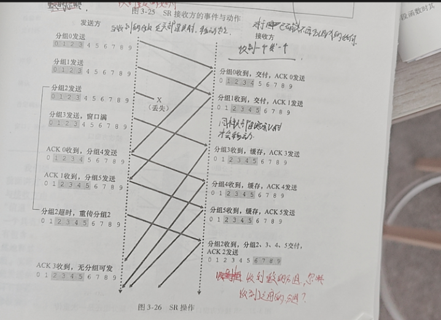

然而这种方式有时会**无法确认发送的分组是上次的还是这次的**

### 比较

出错率低：比较适合**GBN**，出错非常罕见，没有必要用复杂的SR

链路容量大（延迟大、带宽大）：比较适合SR而不 是GBN，**一点出错代价太大**

### 窗口的最大尺寸

GBN：$2^n-1$

SR：$2^{n-1}$

## TCP

TCP被称为**面向连接的**，即两个进程开始发送数据之前必须相互发送某些预备报文段。

TCP只在**端系统**中运行，**所有的中间网络元素不会维持TCP连接状态，**事实上中间路由器对TCP连接完全**视而不见**，它们看到的是**数据报**而不是连接。

TCP是**全双工服务**，应用层数据在从进程B流向进程A的时候，也能从进程A流向进程B

TCP连接是**点对点**的，不可能出现一个发送方将数据传送给多个接收方，两台主机是一对。

一旦建立起一个TCP连接，两个应用进程之间就可以相互发送数据了，客户进程通过套接字传递数据流，数据一旦通过套接字，他就有进程中的TCP控制了，TCP将数据引导至发送方的缓存中，接下来TCP会不时的从发送缓存中取出一块数据并将数据传递到道网络层，在另一端TCP将报文段的数据放入接收缓存中，然后应用进程从缓存中读取数据。

### TCP连接管理

当两个进程想建立连接时，客户的应用进程首先会通知客户TCP，然后客户TCP进行以下三步与服务器TCP建立连接

+ 客户端的TCP首先向服务器的TCP发送一个特殊的TCP报文段，该报文段**不包括应用层数据**，报文段首部的一个标志位**SYN被置为1**，然后**随机初始化一个序号**，最终将报文段**封装到IP数据报**中送到服务器TCP
+ 服务器TCP收到数据报后，为TCP连接**分配变量和缓存**，然后返回一个确认报文(SYNACK)，其中也**不会携带应用层数据**，确认报文中**SYN也被置为1**，**确认号设置为客户端序号+1**，然后再**随机初始化一个序号**。
+ 客户端收到SYNACK后，**分配连接的变量和缓存**，然后**返回一个确认报文段**，其中**SYN为0**，因为连接已经建立，这里的报文段**可以携带数据**

因此TCP连接是**三次**握手，防止半连接状态

结束连接

发送方会发送一个**FIN置为1**的报文段，接收方收到后**返回确认报文段**，然后接收方发送自己的**终止报文段**(FIN为1)，发送方收到后会发送一个**确认报文**，再等待一段时间才会关闭，一般是两个生命周期长度

当主机收到的分组与**套接字**不匹配时，TCP会返回一个**重置报文段(RST置为1)**，UDP会返回**ICMP数据报**

### 报文段结构

TCP报文段结构由**首部字段**和一个**数据字段**组成，数据字段和首部字段不是对齐的。

TCP从**从缓存中取出放入报文段中的数据数量**受限于**MSS**(最大报文段长度)  ，当TCP发送一个大文件时，通常将该文件划分为**长度为MSS的若干块**。MSS通常根据最初确定的由本地发送主机发送的**最大链路层帧长度MTU**来设置，设置MSS需要保证**MSS+TCP报文段首部(一般是40字节)不超过MTU**。

TCP把数据看作是一个**无结构的，有序的**字节流。一个报文段的**序号**是该报文段**首字节的字节流编号**，假定数据流由一个500,000字节的文件组成，其MSS为1000字节，则TCP将为数据流构建500个报文段，给第一个报文段编号0，第二个报文段编号1000，第三个报文段编号2000....，注意TCP连接双方均可**随机选择**初始序号，并不是一定从0开始。

确认号——主机A填充到主机B的确认号是**主机A期待从主机B收到的下一字节的序号**

初始时，主机A有序号42 主机B有序号79，在TCP建立连接后但还没有发送数据前，主机A等到字节79，主机B等待字节42，因此第一个报文段的确认号是79；主机B在收到报文段42后，下一次期待收到43，因此发送的报文段中的确认号是43；主机A收到79后，期待下次收到80，因此报文段中的确认号将会是80.

### 往返时间的估计与超时

报文段的**样本RTT(SampelRTT)**是**从报文段被发送到接收到对该报文段的的确认**之间的时间量。大多数TCP实现仅在某个时刻**做一次**SampleRTT测量，而不是**为每个**发送的报文段测量一个SampleRTT，且绝不会为重传的报文段测量SampleRTT。

由于路由器的拥塞和端系统负载的变化，SampleRTT会随之**波动**，为了估计一个典型的RTT，TCP会维持一个SampleRTT的均值**EstimatedRTT**，一旦获得一个**新的SampleRTT**，TCP就会根据`EstimatedRTT= (1-a)*EstimatedRTT+ a*SampleRTT`**重新估算**EstimatedRTT.

除了估算RTT外，测量RTT的**变化**也是有价值的，定义**DevRTT**用于估算SampleRTT偏离EstimatedRTT的程度

`DevRTT= (1-B)*DevRTT+ B*|SampleRTT-EstimatedRTT|`

TCP的超时时间间隔一般设置为**TimeoutInterval = EstimatedRTT + 4*DevRTT**，出现超时后，TimeoutInterval将**加倍**

###  可靠数据传输协议

TCP中只有**一个定时器**

发送方事件：

+ 从上层应用程序接收数据，将数据封装到报文段中，并将报文段交给IP，如果该报文段是**最早未被确**认的报文段，则开启定时器。
+ 一旦超时，则重传**引起超时的报文段(一个)**，然后**重启定时器**
+ 收到确认报文段后，将**ACK与sendbase**(最早未被确认)比较，TCP采用**累积确认**，如果y>sendbase，则说明y即y之前的都已经收到了，然后**更新**sendbase值，并为未确认的报文段**重启定时器**。因为采取累积确认所以即使前面返回的确认报文丢失了，但只要**有后面的确认报文到达**，就不会引起重传。

接收方会**丢失重复的报文段**，并发送ACK，这里的ACK是期待收到的下一个字节的序列号，而不**是重复报文段的序列号**。

 TCP连接中收到**失序**报文段的行为(**丢失?缓存**)由编程人员确定，**没有明确规定**。

由于TCP超时重传时会把超时间隔翻倍，这会使得超时周期较长，发送方收到**冗余ACK三次**(接收方收到**失序**的分组时会返回**最早已被确认的分组的ACK**)时将会执行**快速重传**。

### 流量控制

用以消除发送方使接收方缓存溢出的可能。

TCP发送方维护一个称为**接收窗口**的变量，该变量指示发送方——**接收方还有多少可用的缓存空间。**由于TCP使全双工通信，因此**两端**都有一个接收窗口。

定义变量

LastByteRead为主机上**应用进程**从**缓存中读出**的数据流的最后一个字节的编号

LastByteRcvd为主机收到的并**放入缓存中**的数据流的最后一个字节的编号

RevBuffer为**缓存**的大小

那么要求

**LastByteRevd - LastByteRead<=RevBuffer**

则接收窗口表示为**rwnd = RevBuffer -[LastByteRevd - LastByteRevd ]**，LastByteRevd - LastByteRead就是接收但未确认的数据。

接收方将rwnd放入发送给发送方的报文中，初始时rwnd=RevBuffer，接收方跟踪LastByteSent和LastByteAcked，LastByteSent- LastByteAcked就是接收方接收但未确认的数据，发送方需要保证整个连接的过程中**rwnd>=LastByteSent- LastByteAcked**

假设在将**rwnd=0**发送给发送方后且**接收方不会再发送任何数据**，这时因为**发送方无法知道接收方的缓存是否有新的空间**，发送方会被**阻塞**将不再发送数据。为此，**当接收方rwnd=0时**，发送方**会继续发送只有一个字节的报文段**，最终缓存开始清空，这些报文段会被**确认**，确认报文中将带有**非0的rwnd**

### 拥塞控制

非正式的定义: “太多的数据需要网络传输，超过了网络的处理能力”

第一种假设，一个路由器具备**无限大的缓冲**且不会发送**重传**

当发送速率在**0~R/2**之间时，**接收方的吞吐量等于发送速率**，然而当发送速率**超过R/2时**，吞吐量**只能到达R/2**，这是由**链路容量**造成的，链路完全不能以超过R/2的稳定状态速率向接收方交付分组。

当发送速率**接近R/2时**，**平均时延会越来越大**，**超过R/2时**，路由器中的平均排队分组数就会**无限增长**

代价：**分组的到达速率达到链路容量时**，分组**经历巨大的排队时延**

第二种假设，路由器有**有限**的缓冲，丢失分组会**重传**

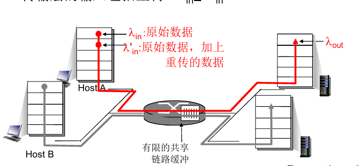

这里称$\lambda_{`in}$为**供给载荷**

代价：发送方在遇到较大时延时所进行的**不必要的重传**会引起**路由器其利用器链路带宽转发不必要的分组副本**

第三种假设，具有多重路径时

代价：分组**丢失**时，关于这个分组的**上游传输能力都被浪费了**。

## 拥塞控制方法

在最为宽泛的级别上，可以根据网络层是否为运输层拥塞控制提供了**显示帮助**来区分。

端到端的拥塞控制，网络层没有提供**显示支持**，端系统根据**延迟**和**丢失**事件推断是否有拥塞。

网络辅助的拥塞控制：路由器提供给端系统以**反馈信息**

**TCP**使用**端到端的拥塞控制**，因为路由器**不向主机反馈**有关拥塞的信息，这符合网络核心简单的TCP/IP架构原则

发送方根据感知到的网络拥塞程度(**超时，冗余ACK**)来**限制**其向连接**发送流量的速率**，发送方会跟踪一个**拥塞窗口变量cwnd**，发送方中 **LastByteSent-LastByteAcked<=min{cwnd,rwnd}**，即限制了已发送未确认的分组数。

TCP拥塞控制算法包括三部分：**慢启动，拥塞避免，快速恢复**，其中前两个是**一定包括**的部分。

慢启动是TCP建立连接后的**第一个模式**，该模式下cwnd通常被**初始化为1MSS**，慢启动阶段cwnd**每经历一个RTT**(TCP一次性将窗口中所有的报文发出，所有报文确认的事件近似一个RTT)就会**翻倍**，慢启动的目的就是为了**快速找到上限**。

+ 出现**超时**，设置**阈值ssthresh为cwnd/2**，然后将**cwnd设为1**，这里试探到了上限
+ **当cwnd到达阈值时**，会进入**拥塞避免**模式
+ 接收到**三次冗余确认**，进入**快速恢复**阶段，设置**阈值ssthresh为cwnd/2**，然后**cwnd = ssthresh + 3MSS**

**拥塞避免是一个速率缓慢且线性增长的过程**，这里每经历一个RTT，cwnd就增加**1**，假设`cwnd`包含`10`个报文的大小，则每接收到一个确认报文，`cwnd`增加1/10 MSS

+ 出现**超时**，设置**阈值ssthresh为cwnd/2**，然后将**cwnd设为1**，进入**慢启动**
+ 接收到**三次冗余确认**，进入**快速恢复**阶段，设置**阈值ssthresh为cwnd/2**，然后**cwnd = ssthresh + 3MSS**

快速恢复阶段，没收到一个冗余分组cwnd就增加**1**

+ 接收到**新的确认报文**，**cwnd设置为ssthresh**，然后进入**拥塞避免**
+ 出现**超时**，设置**阈值ssthresh为cwnd/2**，然后将**cwnd设为1**，进入**慢启动**

简单总结，一旦超时就重置阈值和cwnd，重新开始慢启动；收到三次冗余确认，重置阈值和cwnd，进入快速恢复；慢启动达到阈值，进入拥塞避免；快速恢复收到新的确认报文进入拥塞避免；

# 网络层/数据平面

## 概述

网络层能被分为两个相互作用的部分——**数据平面和控制平面**。

数据平面决定到达路由器输入链路之一的数据报如何**转发**到该路由器**输出链路**之一。

控制平面决定数据报从源主机到目的主机端到端路径中路由器之间的**路由**方式。

实际上分别对应网络层的两个功能：**路由**和**转发**

转发功能依赖于**转发表**，每台**网络路由器**都一个转发表，路由器**检查**到达分组**首部**的一个或多个**字段值**，进而使用这些字段值在转发表中**索引**，索引指出了分组被转发的路由器的**输出链路接口**。

而转发表的配置与路由选择有关，**路由选择算法**决定了插入路由器转发表的内容。

传统的方法是一台路由器中的路由选择算法与**其他路由器**中的路由选择算法**通信**，以此来算出转发表的值。

SDN方法则是使用**远程控制器**计算和分发**转发表**以供每台路由器使用，控制选平面**路由选择功能**是与**物理**的路由器是**分离**的。

## 网络服务模型

因特网的网络层提供了单一的服务，称为**尽力而为的服务**，传送的分组既不能保证以发送的**顺序**被接收，也不保证有**最小的带宽**，不保证能最终**交付**，不保证**时延**

路由器使用**最长前缀匹配规则**

## IPV4	

一个IP数据报至少有**20字节**的长度，如果数据报承载一个TCP报文段，那么总共承载了总长为**40字节**的首部。

链路层帧能承载的最大数据量称为**MTU**，它严格**限制**着**IP数据报**的长度。

链路层协议的MTU并不一定**相同**，而发送方到接收方路径上的每段链路可能**使用不同的协议**，因此IP数据报需要**分片**，即将IP数据报中的数据分片成两个或多个较小的IP数据报**(片**)，然后用单独的链路层帧封装这些较小的数据报，再发送出去。片在到达**运输层**以前需要**重新组装**，这个工作被设计到**端系统**中，而不是**网络层**中。

 

IPV4中数据报的**首部**中存在**标识，标志和偏移字段**，当生成一个数据报时，发送主机会在该数据报设置源和目的地址的同时贴上**标识号**，通常每发送一个数据报，标识号**加一**。

在需要分片时，形成的片中包含有源地址，目的地址和**标识号**，当目的地收到一系列数据报时，可以通过**检查数据报的标识号**来确认哪些数据报属于**同一个较大数据报的片**。为了确认较大数据报的**最后一个片**，最后一个片的**标志比特位**被设置为0，而其他的片都为**1**，另外，为了确认是否有**丢失**片并能**正确组装片**，会使用**偏移字段**来指定该片在**初始IP数据报**的**哪个位置**。

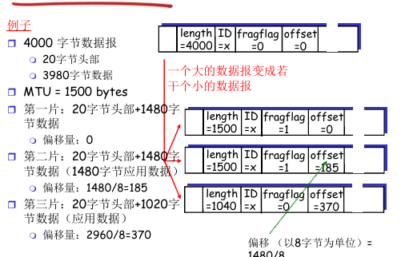

注意每个片都会有一个**首部**，在计算偏移量的时候**不包括首部字节**，要**除以8**

一台主机通常只有**一条链路**连接到网络，主机与物理链路之间的边界称为**接口**，路由器有**多个接口**(由它的工作决定的)，**IP地址**与这些**接口**相关联，但**不**是与**主机或路由器**关联。

一个IP地址长**32**位，使用**点分十进制记法**。

IP地址中**高位**部分称为**子网**部分，**低位**称为**主机**部分，一个**子网**中节点的**IP地址**的**高位部分**都相同，子网内的主机可以在**物理**上直接到达**无需路由器介入**。

这里的223.1.1.0/24

、

下图中有**六**个子网，注意路由器对应有**多个**IP地址，因为它有多个**接口**，而IP地址是**对应接口**而不是对应主机的

## IP编址

**分类编址**下IP地址的**网络部分**被限制为**8(A)，16(B)，24(C)**比特，此外还有一类**广播**地址**255.255.255.255(全为1)**，当发送广播的时候，**报文会交付给同一个网络下的所有主机**。在这种分类下：A类有256个，B类有65536个，C类有几千万个，分配的地址空间跨度太大，利用率低下。

为此出现了**CIDR**(Classless InterDomain Routing)，规定了**子网部分**可以在**任意位置**，地址格式: a.b.c.d/x, 其中**x** 是地址中子网号的**长度**

路由聚合：**使用单个网路前缀通告多个网络**，前面的路由器只负责一个前缀，遇到相同的前缀则使用**最长前缀匹配**。

一个设备获取IP地址一般分两步：一是该设备所在的组织获得一个地址块，而是该设备从地址块中取得以恶地址

一个**组织**的地址**块**从**ISP**分得的地址块中取得，而ISP**本身**的地址块是从**ICANN**(管理IP地址空间并向个ISP和其他组织分配地址块的**全球性权威机构**)得到的。

注意这里IP地址的**第三位**，是由**起始**编码计算的

当组织获得了一块地址后，它就可以为**内部的主机**与**路由器接口**逐个的分配IP地址，这项工作一般由DHCP(**动态主机配置协议**)完成，也可以手动实现。

DHCP允许主机**自动获取**一个**IP地址**，这个IP地址可以是**临时**的也可以是一个**固定**的，此外还有**第一跳的路由器地址**，**本地DNS服务器地址**和**子网掩码**

DHCP是一个**客户-服务器**协议，客户通常是新到达的**主机**。一般每个子网将具有一台**DHCP服务器**，如果某个子网中没有该服务器，则需要一个**DHCP中继代理**(一般是路由器)，这个代理知道用于该网络的**DHCP服务器地址**

DHCP协议是一个四步的协议

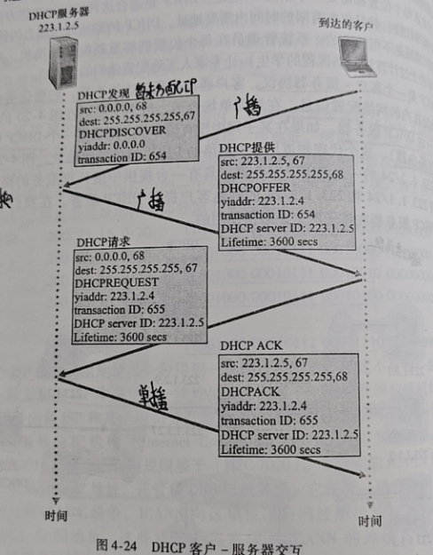

+ DHCP服务器发现：一个新到达的主机的**首要任务**是**发现**一个要与其交互的**DHCP服务器**。通过使用**DCHP发现报文**来完成，其中**目的地址是一个广播**，**源地址是0.0.0.0**
+ DHCP服务器提供：DHCP服务器收到一个DHCP发现报文时，用**DHCP提供报文**做出响应，该报文向子网所有的节点**广播**，提供的报文中除了发现报文的事务ID，向客户推荐的IP地址，网络掩码外，还有**IP地址租用期**
+ DHCP请求：客户从**一个或多个**服务器(子网中可能有**多个DHCP服务**器，客户从其中选取一个最优的)中选择一个，并发送**DHCP请求报文**
+ DHCP ACK：服务器用**DHCP ACK报文**对请求响应

DHCP还提供了 一种机制以允许客户更新对一个IP地址的**租用**

从移动性的角度来看，DHCP有严重的**缺陷**：每当节点移动到一个新的子网时，就要从DHCP中区的一个新的TCP连接。因此当节点在子网中移动时，就不能维持与远程应用之间的**TCP连接**(IP变化)。

## IPv6

IPv6将IP地址的长度从**32比特**增加到128比特，许多**IPv4字段**都被**舍弃**或作为**选项**。一个IPv6的首部字段大小固定为**40字节**。

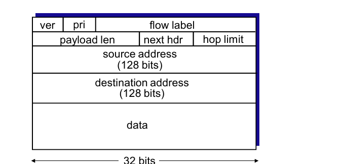

IPv6不允许**中间路由器**进行**分片与重新组装**，这种操作只能在**源和端**执行，如果路由器收到的数据**太大**而不能**转发**到链路上的话，路由器只需要**丢掉**该数据报，并向发送方发送一个“分组太大”的**差错报文**。

此外，IPv6不会做**检验和**

目前IPv6的覆盖率还不高，从广泛应用的IPv4迁移到IPv6的方法包括有**建隧道**：将两台IPv6路由器之间的**IPv4路由器集合**合称为一个**隧道**，借助隧道在隧道发送端的IPv6节点可将**整个IPv6数据报**放到一个**IPv4数据报中(作为有效荷载)**，于是该IPv4数据报的**地址**设为指向**隧道接收端的IPv6节点**，隧道接收端的**IPv6节点**最终收到**该IPv4数据报**，它会从中**提取出IPv6数据报**，然后继续为IPv6数据报提供**路由。**

## 通用转发和SDN

通用转发中将使用**流表**（匹配加动作），匹配时会使用**网络层/链路层的源和目的地址**做出转发决定，因此这里的转发设备被描述为**分组交换机**，而不是第三层的路由器或是第二层的交换机

Openflow匹配允许对来自**三个层次的协议首部**所选择的字段进行匹配，流表项可以使用**通配符**进行匹配，同时每个流表项也有自己的**优先级**，当一个分组匹配**多个**流表项时，将会使用**具有最高优先级**的那个。

流表由**远程控制器计算**，流表包括三个部分：**首部**(匹配不上的将会丢弃或送回远程控制器)，**计数器**(包括已与该表项匹配的分组数量以及该表项上次更新以来的时间)，**动作**(转发，丢弃，复制，重写首部字段)

SDN可以指定传送的数据报经过某一个路由器。

# 网络层/控制平面

## 路由选择算法

路由选择算法的目的是从发送方到接收方的过程中确定一条通过路由器网络的**好的路径(具有最低的开销)**

路由选择算法的一种分类是根据该算法是**集中式**的还是**分散式**的来划分，集中式的称为**链路状态算法(LS)**，分散式的称为**距离向量算法()**

第二种分类方式是根据算法是**动态**的还是**静态**的

第三中分类方式是根据它是**负载均衡**的还是**负载敏感**的。

##  链路状态路由选择算法(LS)

**网络拓扑和链路开销是已知的**即需要**全局信息**，使用dijkstra算法

D(v)是从源到当前节点的最低开销

P(v)是最短路径上到v的前一节点

C(i,j)是两个节点之间的开销

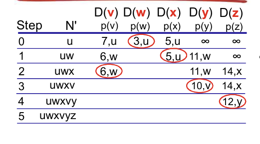

链路状态算法可能会出现震荡问题

在**链路成本等于链路上的负载**的情况下，初始时B和D会发送一单位的数据到A，C会发送e单位的数据到A，初始路由选择如下：
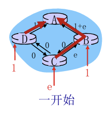

第二轮时C和B会选择顺时针到A，因为链路开销最小，而下一轮又会变为逆时针

## 距离向量路由选择算法(DV)

距离向量算法是一种**异步的，迭代的，分布式**的算法( Bellman-Ford)，因为每个节点都要从一个或多个**邻居接受信息**，执行**计算**，然后将计算出的信息**分发**给邻居，这个过程会持续到邻居之间**无更多要交换的信息**为止，节点之间不需要**步伐一致**的操作。

$D_x(y)表示从x到y的最小路径，D_x(y)=min(c(x,x的邻居)+D_{x的邻居}(y)$

链路开销变化时也可能发送故障，如下所示

​	

当v->x的开销变为60时，$D_y(x)=6$因为**y只知道z到x的开销为5**，然后y会把这个信息通知给他的z，z会更新为7，因为**它只知道y到x为6**，因此会出现选择环路，不断地更新下去直到z算出它经过y到达x的开销大于等于50，这可能是异步导致的。

正常的变化如下

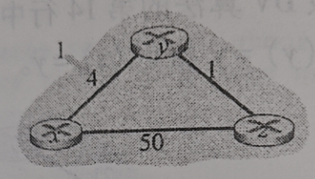

1. **在 \( t_0 \) 时刻**，节点 \( y \) 检测到链路开销变化（开销从 4 变为 1），更新其距离向量，并通知其邻居这个变化，因为最低开销路径的开销已改变。

2. **在 \( t_1 \) 时刻**，节点 \( z \) 收到来自节点 \( y \) 的更新报文并更新了其距离表。节点 \( z \) 计算出到节点 \( x \) 的新最低开销（从开销 5 减为开销 2），然后向其邻居发送了它的新距离向量。

3. **在 \( t_2 \) 时刻**，节点 \( y \) 收到来自节点 \( z \) 的更新报文并更新了其距离表。由于节点 \( y \) 的最低开销未发生变化，因此节点 \( y \) 不发送任何报文给其他节点，算法进入静止状态。

## OSPF(开放最短路优先)

之前的研究将所有路由器看作是**一个集合**，并使用**相同的路由选择算法**来计算，但这是不可能的，因为：

+ 规模：当今的互联网由**数以亿计**的路由器组成，这些主机中存储的**路由选择信息**需要非常大的**内存**，在所有路由器之间**广播**连通信和**链路开销更新**所要求的**负担**是十分庞大
+ **因特网是ISP的网络**，每个ISP都有自己的**路由器网络**，ISP通常希望**按自己的意愿**运行路由器

因此引入**AS(自治系统)**，每个AS由处在**相同控制管理下**的路由器组成，通常在**一个ISP中的路由器和互联它们的链路构成一个AS**，AS下的路由器**执行相同的路由选择算法**，并且**拥有彼此的信息**。

AS**内部**路由选择使用**OSPF**(开放最短路优先)，OSPF是一种**链路状态协议**，它使用**泛洪链路状态信息和Dijkstra算法**，一台路由器构建了一幅关于整个**自治系统**的完整**拓扑图**，每台路由器在本地运行Dijkstra算法，以确定以**自身**为根节点到**所有子网**的最短路径树

使用OSPF时，**路由器**向自治系统内所有的路由器**广播路由选择信息**，而不仅仅是**邻居**，每当一条链路的状态发生**变化**时，路由器就会**广播链路状态信息**，即使**没有**链路发生变化，它也会**周期性**的官广播联络状态。

OSPF的优点有：

+ 支持**单播和广播**
+ **安全**
+ 如果有多条**相同开销**的路由，可以**同时使用**
+ 自治域AS中能**层次化配置区域**，每个区域都运行自己的**OSPF**算法，区域内部的每台路由器都会向其他路由器**广播链路信息**，每个区域内会有一台或多台**边界路由器**，为**流向边界以外**的分组提供路由选择，AS内会有一个区域被配置为**主干区域**，主干区域为**区域之间的流量**提供路由选择，主干区域包括**所有的边界路由器和其他一些路由器**。AS区域间的路由选择会先将分组路由到**边界路由器**，然后通过**主干**路由到位于目的地区域的**边界路由器**，然后再路由到**最终目的地**

## ISP之间的路由选择：BGP

BGP是**自治系统间的路由选择协议**，所有的AS都运行**相同**的AS间路由选择协议——**边界网关协议**，这是一种**分布式的异步的**协议

通过BGP协议，**路由器可以从邻居AS获得前缀(子网)的可达性信息**

AS中的路由器分为**网关路由器**和内部路由器，网关路由器是位于**AS边缘**的路由器，它**直接连接**到**其他AS**中的一台或多台**路由器**，为了**通告**路由信息，路由器之间会进行**BGP连接**，**跨越AS**的BGP连接称为**外部BGP(eBGp)**，在**相同AS**之间的路由器BGP称为**内部BGP(iBGP)**

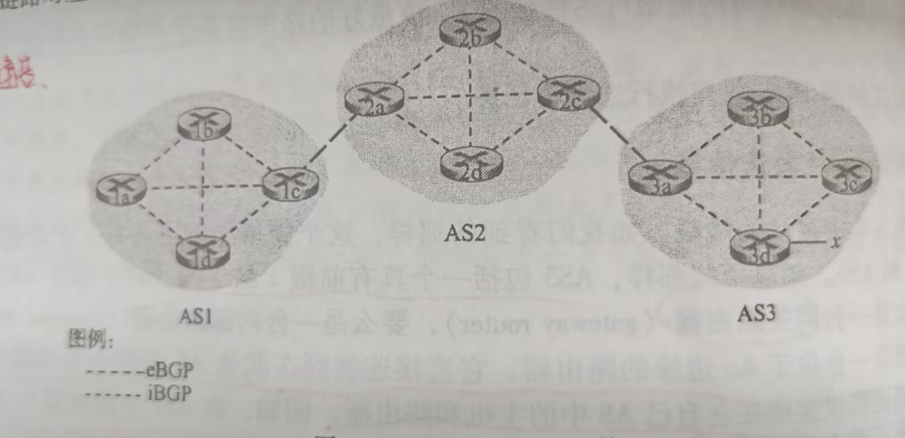

向所有的路由器通告对于前缀x的可达性信息：首先网关路由器3a向网关路由器2c发送一个**eBGP报文"AS3 x"**，网关路由器2c向**其他所有路由器**发送**iBGP "AS3 x"**，然后网关路由器2a向网关路由器1c发送一个**eBGP报文"AS2 AS3 x"**，网关路由器1c向**其他所有路由器**发送**iBGP "AS2 AS3 x"**，这样AS1和AS2中所有的路由器就知道了前缀x的存在并且知道了**通往x的AS路径**。

在真实的网络中一台路由器可能会知道**多条到特定前缀的不同路由**，最好的路由将给予**策略和可达性信息**来确定

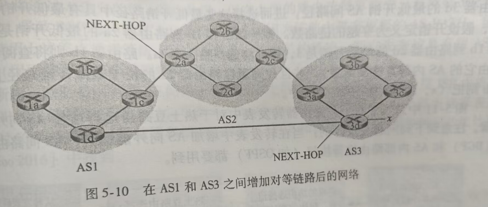

# 链路层

链路层中将运行链路层协议的任何设备成为**节点**(主机，路由器，交换机，wif接入器)，节点之间的通信信道称为**链路**。

链路层提供的服务有：

+ 将数据报封装成**帧**
+ **差错检测和纠正**
+ 可靠交付，**保证无差错的经过链路层移动每个网络层数据报，对于低比特差错的链路(有线)，可靠交付被认为是一种不必要的开销**
+ 全双工和半双工

链路层的主体部分在**网络适配器(网卡)**中实现的

## 差错检测和纠正

在发送节点为了保护比特免受差错，使用**差错检测和纠正比特(error detection and correction EDC)**，来增强数据D(作为**冗余比特)**，不过即使使用了EDC也可能有**未检测出的差错**

差错检测中的三种方法：**奇偶校验，检验和方法，循环冗余检测**

奇偶校验中，发送发只需添加**一个额外比特**，该比特的值取决于**奇检验还是偶检验**，在偶检验中，**d+1个比特中1的个数是偶数**，即冗余比特的值是用来**补位**的，接收方只需**数1的个数**即可，但是这种方法无法检测出**偶数个错误**

奇偶校验可以扩展为**二维**的，这样可以准确的找出出错的比特位

检验和：与UDP中的检验一致

**循环冗余检测(CRC)**：发送方与接收方**沟通一个r+1位G**，然后接收方在数据D后面**添加r位的冗余位**，扩充后的数据必须能够**模G**，接收方在收到数据后必须也能**模G**，否则就有**差错**。

关键在于确定冗余位R，通过公式变化得

计算过程中的**减法操作**可以看作是**异或运算**

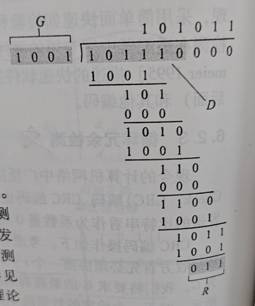

